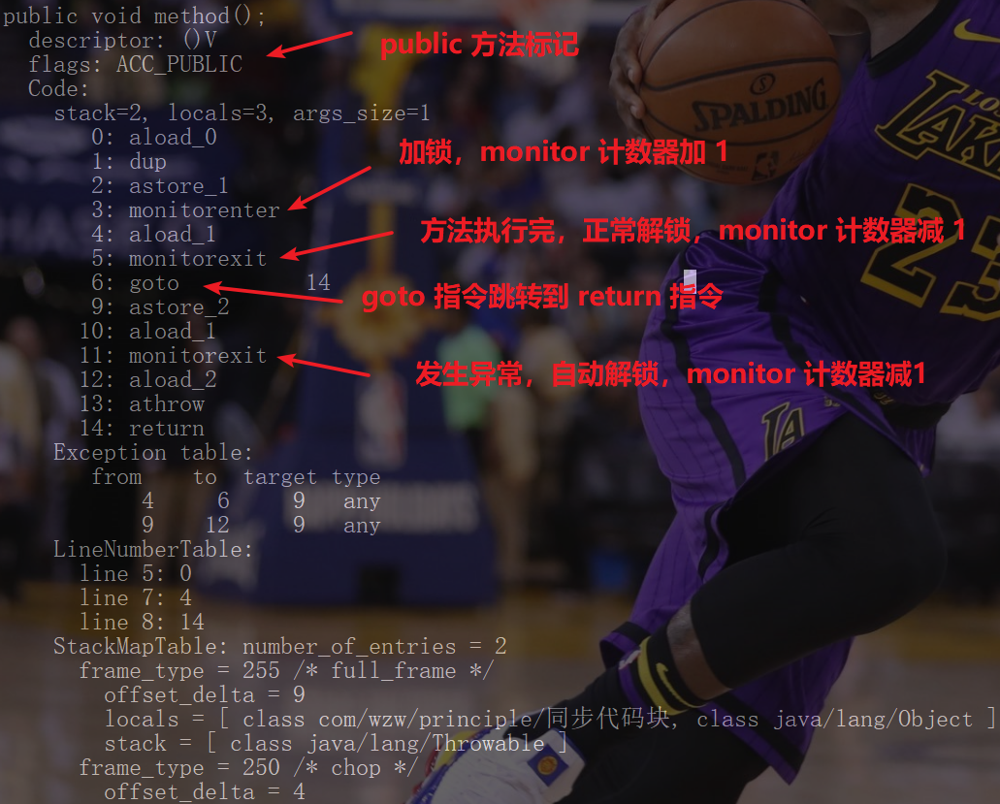
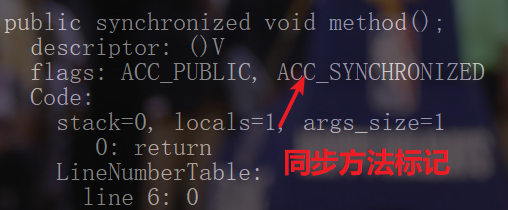
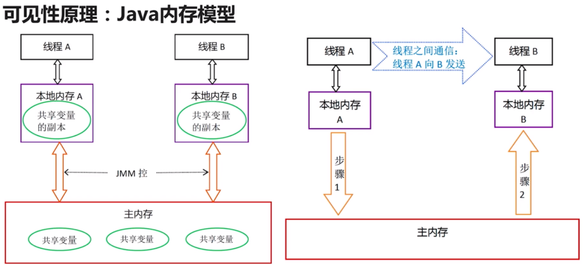

**0、synchronized 的特点：**

可以保证代码的原子性和可见性。

**1、synchronized 的性质：**

可重入（可以避免死锁、单个线程可以重复拿到某个锁，锁的粒度是线程而不是调用）、不可中断（其实也就是上面的原子性）

**2、synchronized 的分类：**

- 按照作用对象划分为 **对象锁**、**类锁**
- 按照作用位置划分为 **代码块**、**方法（静态和非静态）**
- 按照具体细节划分为 **实例（普通方法）同步方法**、**静态同步方法**、**实例方法中的同步代码块**、**静态方法中的代码块**。

*如果从类是 Class 对象的角度看，类锁也是对象锁，但上面这样划分的解释性更好。*

**3、使用 synchronized 进行线程同步的七种情况：**

- 1、**多个线程同时访问一个对象的同步方法**，因为多个线程要竞争这个对象的对象锁，没有拿到对象锁的线程进入阻塞状态，所以多个线程将串行执行这个方法，线程安全。

- 2、**多个线程访问的是多个对象的同步方法**，因为每个线程都可以拿到对于对象的对象锁，所以多个线程可并行（多核处理器）执行这个方法，各个线程互不影响。

- 3、**多个线程访问的是 synchronized 的静态方法**，因为多个线程要竞争对象对应的类对象（Class 对象）的类锁，没有拿到类锁的线程进入阻塞状态，所以多个线程将串行执行这个方法，线程安全。

- 4、**多个线程同时访问一个对象的同步方法与非同步方法**，因为线程执行这个对象的同步方法需要拿到对象锁，而非同步方法不需要锁，所以多个线程将串行执行同步方法，同步方法线程安全，非同步方法多个线程可以并行访问。

- 5、**访问一个对象的不同的普通同步方法**，因为对象锁只有一把，线程执行同步方法时都需要拿到对象的对象锁，所以只有当一个线程把所有的同步方法都执行完（对象锁的可重入性）后，这个对象锁才被释放，能够被其他线程拿到。

- 6、**多个线程同时访问静态 synchronized 和非静态 synchronized 方法**，因为线程访问静态 synchronized 方法时需要拿到对象对应的类对象的类锁，访问非静态 synchronized 方法时需要拿到对象的对象锁，所以多个线程访问静态 synchronized 方法和非静态 synchronized 方法时需要竞争这两把锁。

- 7、**线程在执行同步方法时抛出异常，会自动释放锁**，以便其他线程可以拿到锁继续执行。

**4、synchronized 的相关原理：**

加解锁原理、可重入原理、可见性原理

**从反编译看加解锁原理：**

> 对于用 Java 编写的代码，最常见的同步形式可能是 synchronized 方法。通常不使用 monitorenter 和 monitorexit 实现同步方法，而是通过 ACC_SYNCHRONIZED 标志在运行时常量池中进行简单区分，该标志由方法调用指令检查。
>
> —— Java 虚拟机规范

同步代码块形式：

``` java
public class SynchronizedCodeBlock {
	public void method() {
		synchronized (this) {
			// 空
		}
	}
}
```

使用 `javap -verbose SynchronizedCodeBlock.class` 命令反编译结果如下图：

同步代码块形式，使用 monitorenter 和 monitorexit 指令显式对代码块加解锁。

同步方法形式：

``` java
public class SynchronizedMethod {
	public synchronized void method() {
		// 空		
	}
}
```

使用`javap -verbose SynchronizedMethod.class` 命令反编译结果如下图：



同步方法形式，使用 ACC_SYNCHRONIZED 标记隐式对方法加解锁。

**方法测试可重入性原理：**

代码：

``` java
public class ReentrancyTest {
	public synchronized void method1() {
		System.out.println("线程" + Thread.currentThread().getName() + "执行 method1");
		method2(); // 测试可重入性
	}
	
	public synchronized void method2() {
		System.out.println("线程" + Thread.currentThread().getName() + "执行 method2");
	}
	
	public static void main(String[] args) throws InterruptedException {
		Reentrancy reentrancy = new Reentrancy();
        // 方法体执行对象
		Runnable run = ()-> {
			reentrancy.method1();
		};
		Thread thread1 = new Thread(run);
		Thread thread2 = new Thread(run);
        // 启动线程
		thread1.start();
		thread2.start();
        // 主线程等待子线程执行完毕
		thread1.join();
		thread2.join();
		System.out.println("Finished");
	}
}

```

输出结果为：

``` shell
线程Thread-0执行 method1
线程Thread-0执行 method2
线程Thread-1执行 method1
线程Thread-1执行 method2
Finished
```

JVM 负责跟踪对象被加锁的次数，线程第一次给对象加锁的时候，monitor 的计数变为 1，每当这个相同的线程在此对象上再次获得锁时，计数为递增。当任务离开时，monitor 的计数减 1，当计数为 0 时，锁被完全释放。

**图说明可见性原理：**

JMM 是 Java 内存模型的缩写，直接看图。



**5、synchronized 的缺陷：**

- 效率低：锁释放情况少（一种是代码正常运行结束释放锁，另一种是产生异常释放锁），试图获得锁时不能设定超时，不能中断一个正在试图获得锁的线程。

- 不够灵活（相比于读写锁，读操作不需要加锁，写操作才需要加锁），加锁和释放的时机单一，每个锁仅有单一的条件（某个对象）可能是不够的。

- 无法知道是否成功获取到了锁。

**6、synchronized 常见的面试题：**

1、使用注意点：锁对象不能为空（如果是对象，可以用对象自身的锁，还可以自己造一个锁来让线程竞争）、锁的作用域不易过大、避免死锁（可以用 synchronized 模拟死锁）。

2、如何选择 Lock 和 Synchronized 关键字？

一切选择都要根据具体的业务需要，选择更合适的方式，减少出错。如果有现成的包（java.util.concurrent）和类（原子类、ConcurrentHashMap、CountDownLatch），就不要自己造轮子了，直接拿来用，Java 原生支持的效率也会更高些，如果真的要用到 Lock 或者 Synchronized 独有的特性，再来考虑这两个。

3、多线程访问同步方法的各种具体情况（也就是上面的七种情况）。

**7、对 synchronized 的思考（面试可能也会被问到）：**

1、多个线程等待同一个 synchronized 锁时，JVM 如何选择下一个获取锁的是哪个线程？

这个问题就涉及到内部锁的调度机制，线程获取 synchronized 对应的锁，也是有具体的调度算法的，这个和具体的虚拟机版本和实现都有关系，所以下一个获取锁的线程是事先没办法预测的。

2、synchronized 使得同时只有一个线程可以执行，性能较差，有什么方法可以提升性能？

- 优化 synchronized 的使用范围，让临界区的代码在符合要求的情况下尽可能的小。
- 使用其他类型的 lock（锁），synchronized 使用的锁经过 jdk 版本的升级，性能已经大幅提升了，但相对于更加轻量级的锁（如读写锁）还是偏重一点，所以可以选择更合适的锁。

3、如何想要更加灵活的控制锁的获取和释放，怎么办？

可以根据需要实现一个 Lock 接口，这样锁的获取和释放就能完全被我们控制了。

4、什么是锁的升级、降级？

JDK6 之后，不断优化 synchronized，提供了三种锁的实现，分别是偏向锁、轻量级锁、重量级锁，还提供自动的升级和降级机制。对于不同的竞争情况，会自动切换到合适的锁实现。当没有竞争出现时，默认使用偏斜锁，也即是在对象头的 Mark Word 部分设置线程ID，来表示锁对象偏向的线程，但这并不是互斥锁；当有其他线程试图锁定某个已被偏斜过的锁对象，JVM 就撤销偏斜锁，切换到轻量级锁，轻量级锁依赖 CAS 操作对象头的 Mark Word 来试图获取锁，如果重试成功，就使用普通的轻量级锁；否则进一步升级为重量级锁。锁的降级发生在当 JVM 进入安全点后，检查是否有闲置的锁，并试图进行降级。锁的升级和降级都是出于性能的考虑。

5、什么是 JVM 里的偏向锁、轻量级锁、自旋锁、重量级锁？

偏向锁：在线程竞争不激烈的情况下，减少加锁和解锁的性能损耗，在对象头中保存获得锁的线程ID信息，如果这个线程再次请求锁，就用对象头中保存的ID和自身线程ID对比，如果相同，就说明这个线程获取锁成功，不用再进行加解锁操作了，省去了再次同步判断的步骤，提升了性能。

轻量级锁：再线程竞争比偏向锁更激烈的情况下，在线程的栈内存中分配一段空间作为锁的记录空间（轻量级锁对应的对象的对象头字段的拷贝），线程通过CAS竞争轻量级锁，试图把对象的对象头字段改成指向锁记录的空间，如果成功就说明获取轻量级锁成功，如果失败，则进入自旋（一定次数的循环，避免线程直接进入阻塞状态）试图获取锁，如果自旋到一定次数还不能获取到锁，则进入重量级锁。

自旋锁：获取轻量级锁失败后，避免线程直接进入阻塞状态而采取的循环一定次数去尝试获取锁。（线程进入阻塞状态和非阻塞状态都是涉及到系统层面的，需要在用户态到内核态之间切换，非常消耗系统资源）实验证明，锁的持有时间一般是非常短的，所以一般多次尝试就能竞争到锁。

重量级锁：在 JVM 中又叫做对象监视器（monitor），锁对象的对象头字段指向的是一个互斥量，多个线程竞争锁，竞争失败的线程进入阻塞状态（操作系统层面），并在锁对象的一个等待池中等待被唤醒，被唤醒后的线程再次竞争锁资源。

6、使用 synchronized 实现双重校验锁的单例模式？

单例对象加上 volatile 关键字，可以禁止JVM对指令重排序，因为下面第一处的代码 `doubleCheckSingleton = new DoubleCheckSingleton(); ` 分为三个步骤：1、为 doubleCheckSingleton 分配内存空间；2、初始化 doubleCheckSingleton 对象的值；3、doubleCheckSingleton 指向分配的内存地址，所以执行的步骤可能变成 1、3、2，可能创建多个单例对象，所以给单例对象加上 volatile 关键字是很有必要的。

双重校验是指两次检查，一次是检查单例对象是否创建好了，如果还没有创建好，就第一次创建单例对象时，并在创建过程中锁住单例类（类锁），第二次的检查避免了一个线程在创建单例对象的过程中，也有其他线程也已经通过第一次非 null 判断，当这个线程释放类锁后，其他线程不知道单例对象已经创建好了，而再次创建。在第一次创建实例对象时才需要双重校验，synchronized 才有用武之地，后面只需要一次校验，提高了性能。

代码：

``` java
public class DoubleCheckSingleton {
    // 单例对象
    private volatile static DoubleCheckSingleton doubleCheckSingleton;
    // 构造函数私有化
    private DoubleCheckSingleton() {}
    // 获取单例对象的方法
    public static DoubleCheckSingleton getInstance() {
        if(doubleCheckSingleton == null) {
            synchronized (DoubleCheckSingleton.class) {
                if (doubleCheckSingleton == null) {
                    doubleCheckSingleton = new DoubleCheckSingleton(); // 第一处
                }
            }
        }
        return doubleCheckSingleton;
    }
}
```


