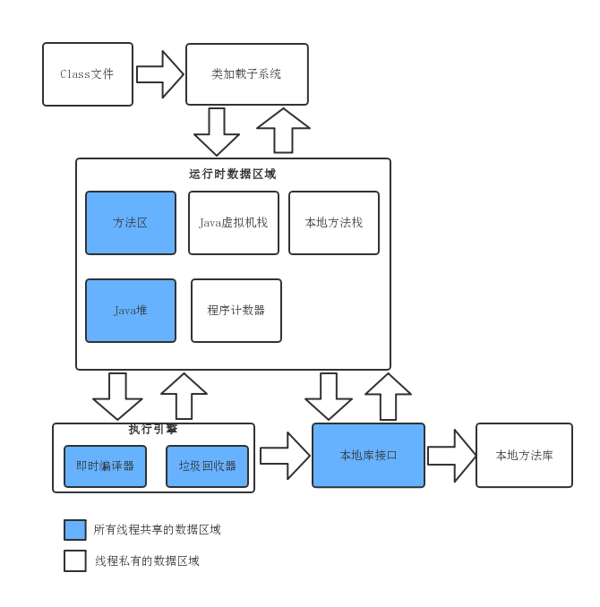
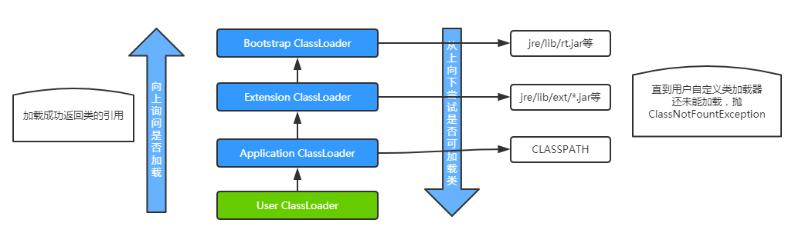
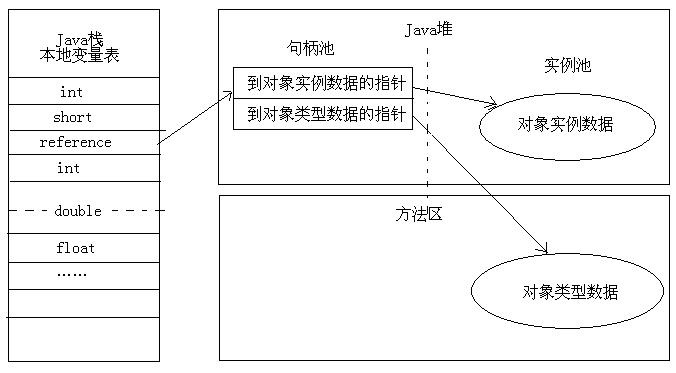
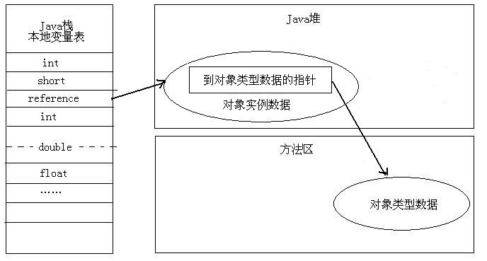
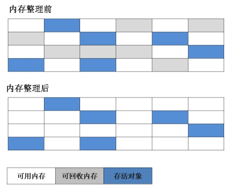
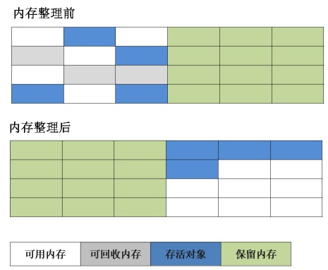
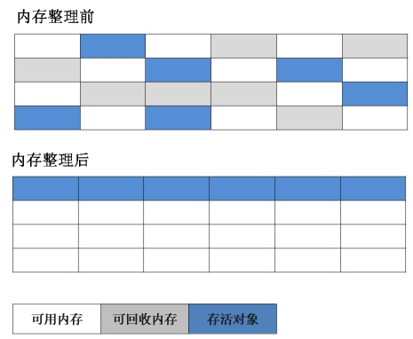
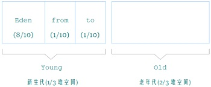

## Java内存管理总结：

**0、Java 对内存的划分：**

Java虚拟机规范将物理内存（主内存和CPU中的缓存、寄存器）划分为 **程序计数器**、**Java 虚拟机栈**、**本地方法栈**、**Java 堆**、**方法区**五个区域，但并没有规定这些区域的具体实现，在其他地方听到的一些名词（如永久代、元空间等，这些都是方法区的具体实现）可能都是这些区域具体的实现，这点要特别注意，别被这些概念搞晕。

各个区域的特点如下表：

|     区域      | 线程关系 |               内存异常               | 垃圾回收 |                             作用                             |
| :-----------: | :------: | :----------------------------------: | :------: | :----------------------------------------------------------: |
|  程序计数器   | 线程私有 |                  无                  |    无    |              记录Java虚拟机正在指向的字节码指令              |
| Java 虚拟机栈 | 线程私有 | StackOverflowError、OutOfMemoryError |    无    | 描述 Java 方法执行时的内存模型，栈中栈帧存储局部变量表、操作数栈、动态链接、方法返回地址等信息。 |
|  本地方法栈   | 线程私有 | StackOverflowError、OutOfMemoryError |    无    |       描述本地方法（非 Java 代码编写）执行时的内存模型       |
|    方法区     | 线程共享 |           OutOfMemoryError           |    有    | 存储虚拟机加载过的类信息、常量（常量池）、静态变量、即时编译器（JIT）生成的代码 |
|    Java 堆    | 线程共享 |           OutOfMemoryError           |    有    |                    存放 Java对象（实例）                     |

**1、类加载器：**

类加载器分为 **Bootstrap**、**Extension ClassLoader**（Java9 中是 Platform ClassLoader）、**Application ClassLoader**，级别也是从低到高。

可以调用类加载器对象的 getParent() 方法查找该级加载器的上一级加载器，也成为父类加载器。

|        类加载器         |                             描述                             | 是否为 Java 实现 |
| :---------------------: | :----------------------------------------------------------: | :--------------: |
|        Bootstrap        | JVM启动时创建，通常由操作系统相关的本地代码实现，是最根基的类加载器，负责装载的是最核心的 Java 类，如 Object 类、System 类、String 类等 |        否        |
|  Extension ClassLoader  |     加载一些扩展的系统类，如 XML、加密、压缩相关功能的类     |        是        |
| Application ClassLoader |             加载用户定义的 CLASSPATH 路径下的类              |        是        |

*此处不翻译了，翻译后就变味了，尤其是下面的 Parents Delegation Model 翻译为双亲委派模型很不恰当。*

字节码文件加载到内存中，才可以实例化出类，而类加载器就是负责加载 Java 类的。低级别的类加载器在加载一个类时会先询问上一级的类加载器，直到询问到顶级的类加载器（Bootstrap），如果顶级的类加载器可以加载就加载该类，否则向下尝试是否可以加载该类，也即是如果上一级类加载器能加载的就用上一级加载（复用上一级的类加载器），用不了再用自身的类加载器加载，这也就是口口相传却是翻译很不恰当的双亲委派模型。这样做可以使类加载更加安全，避免加载和标准 Java 类同包同名的类破坏虚拟机。

可以根据需要继承 Application ClassLoader 实现自定义类加载器，隔离加载器、修改类的加载方式、扩展加载源、防止源码泄露。

**2、类加载的过程：**

类加载是将字节码文件实例化成 Class 对象并进行相关初始化的过程。类加载包括类的**加载**（Load）、类的**链接**（Link）、类的**初始化**（init）三个步骤。

**类的加载**是将字节码文件以二进制流的方式读取到内存中并转化为特定的数据结构，检查 cafe baby 这个魔法数（是不是Java文件的标志），是否有父类等，创建类对应的 Class 对象。

**类的链接**又分为**验证**、**准备**、**解析**三个阶段，验证阶段是进行更加详细的校验，如类型是否正确，静态变量是否合理等；准备阶段是为类的静态变量分配内存空间，并设定默认值；解析阶段是保证类和类之间相互引用的正确性，完成类在内存中的结构布局。

**类的初始化**并不是初始化对象，而是根据代码中的值初始化类的静态变量值，类的静态变量的初始化方式也有直接在声明时指定值和在静态代码块中指定值两种方式。

**3、访问对象的两种方式：**

Java虚拟机栈中的局部变量表存放的数据除了基本的数据类型外，还有对象的引用类型（reference），这关系到如何访问一个对象。

在不同的虚拟机中，对象的访问方式也是不同的，主流的访问方式有**使用句柄**和**直接指针**两种。

- 使用句柄：

**使用句柄** 是在 Java 堆中划分出一块区域作为句柄池，句柄池中存放对象的实例数据和类型数据（类相关的信息），reference 中存放的是对象在句柄中的地址，这是一种间接访问对象方式。

- 直接指针：

**直接指针** 是reference中直接存放对象的地址，但 Java 堆需要考虑如何存放访问对象类型的指针。

两种方式其实各有优劣，如下表：

|   方式   |                             优势                             |   特点   |
| :------: | :----------------------------------------------------------: | :------: |
| 使用句柄 | reference 中存放的是稳定的句柄地址，对象在移动时只改变句柄池中对象的地址，而reference中的地址不需要改变。 | 间接访问 |
| 直接指针 |       节省了一次指针定位的时间开销，访问速度相对更快。       | 直接访问 |

**4、判断对象是否可以回收的算法：**

垃圾回收之前需要判断对象是否可以回收，常见的判断算法有引用计数算法和可达性分析算法。

**引用计数算法：**

每个对象都有对应的引用计数器，当有一个地方引用该对象时，就将引用计数器的值加1，当引用失效时，就将引用计数器的值减1，当计数器的值为0时，表示对象没有引用，可以被回收了。

缺点：看起来简单高效，但是有循环引用问题。如果两个对象中包含对方的引用就会产生循环引用问题，导致垃圾收集器不能回收对象。

**可达性分析算法：**

如果对象与GC Roots 之间没有直接或间接的应用关系，就可以被回收了。常见的 GC Roots 对象包括虚拟机栈（栈帧本地变量表）中引用的对象、方法区中静态属性引用的对象、方法区常量引用的对象、本地方法栈中（Native 方法）引用的对象。GC Roots，是一个特殊的对象，且绝对不能被其他对象引用，不然也会像引用计数算法那样有循环引用的问题。

**5、常见的垃圾回收算法：**

- 标记-清除算法

最基本的垃圾回收算法，后续的算法都是对它的改进。

首先标记出需要回收的对象，再将标记出的区域内容清除。

缺点是：标记时的查找效率，清除时产生内存碎片。

- 标记-复制算法

将内存区域划分为两块，每次只使用一块，垃圾回收时，标记正在使用的内存区域，将存活的对象复制到另一块内存区域，再将原来的那一块内存区域一次性清除。避免了内存碎片的产生，但不适合存活时间长的对象。

缺点：浪费了一半的内存空间，当对象存活率高时，进行大量的复制操作，效率不高。

- 标记-整理算法

标记过程和标记-除算法相同，垃圾回收时，是将存活的对象向同一端移动，再清除这之外的内存区域，这样就使得对象占用的内存区域连续，避免了内存碎片的产生。

- 分代收集算法

根据对象存活时间的长短，将堆内存分为新生代和老生代，存活时间短的对象放在新生代区域，存活时间长的大对象（如对象数组）放在老生代区域。新生代和老生代的比例是 1 : 2，新生代又分为一个 Eden 区和两个 Survivor 区。新生代使用标记-复制算法，老生代使用标记-清除算法或标记-整理算法，这样最大发挥各自算法的优势。

**6、常见的垃圾回收器：**

- Serial 回收器

Serial 采取 “复制算法” 实现，如果是在单 CPU 环境下，Serial 收集器没有线程交互的开销，理论上是可以获得最高的单线程执行效率，STW 的时间也可以控制在几十到几百毫秒内，这个时间是完全可以接受的。

- Serial Old （PS MarkSweep）回收器

Serial Old 收集器 是 Serial 收集器的老年代版本，同样也是一个单线程收集器，使用了 “标记-整理算法”。

- ParNew 回收器

ParNew 收集器实际上就是 Serial 收集器的多线程版本，收集算法、STW、对象分配的规则、回收策略等都与 Serial 收集器完全一样，两者相同的代码很多。ParNew 收集器虽然有多线程优势，但在单 CPU 和多 CPU 环境下，效果并不一定会比 Serial 好，至少在单 CPU 环境下是肯定不如的 Serial 的。

- Parallel Scavenge 回收器

Parallel Scavenge收集器和 ParNew 收集器很像，也是一个新生代收集器，也是使用复制算法，并且还是并行的多线程的收集器。相比于 ParNew 收集器，Parallel Scavenge收集器可以更加精准的控制 CPU 的吞吐量和 STW 的时间，对于交互不多的任务可以更快地完成。

- Parallel Old 回收器

Parallel Old 收集器是 Parallel Scavenge 收集器的老年代版本，使用多线程和 “标记-整理算法”。在 Parallel Old 收集器出现之间，选择了 Parallel Scavenge 收集器作为新生代的收集器，就只能选择 Serial Old 收集器作为老生代收集器，这样肯定就是对多 CPU 的浪费，所以 Parallel Scavenge收集器 + Parallel Old 收集器，对于多 CPU 环境吞吐量要求高的环境，算是强强联合。

- CMS 回收器

CMS （Concurrent Mark Sweep）收集器从英文名字上看就是基于 “标记-清除算法” 实现的，并且还有并发的特点，它是一种以缩短 STW 的时间为目标的收集器，对于一些重视服务响应速度的网站，肯定是 STW 越短，用户体验越好，但是缺点是会在垃圾收集结束后产生大量的空间碎片。

通过初始标记（Initial Mark）、并发标记（Concurrent Mark）、重新标记（Remark）、并发清除（Concurrent Sweep）四个步骤完成垃圾回收。

- G1 回收器

G1 收集器是目前最先进的收集器，也是 JDK7 之后默认的垃圾回收器，它是基于 “标记-复制算法” 实现的，所以不会产生内存碎片，并且也可以精准地控制 STW 的时间。G1 收集器对于新生代和老年代都是适用的，优先回收垃圾最多的区域。