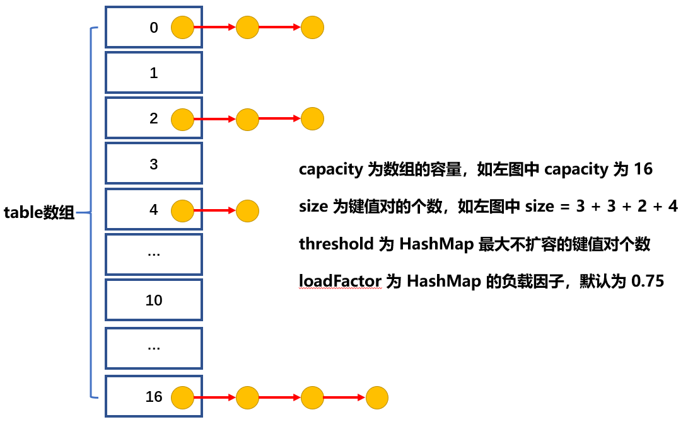
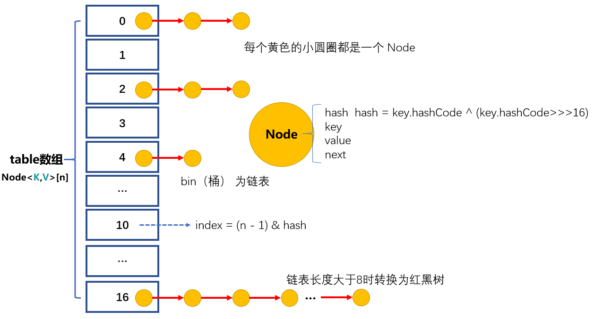

- **问题：HashMap 中的 initCapacity、size、threshold、loadFactor、bin 的理解？**

HashMap 存放的是键值对，但并不是简单的一个萝卜一个坑。

在 HashMap 的有参构造函数中，我们指定 initCapacity，但会取大于或等于这个数的 2 的次幂作为 table 数组的初始容量，使用 tableSizeFor(int) 方法，如给定参数值为 12，函数返回值为 2 的 4次幂即 16，给定参数值为 20，函数返回值为 2 的 5 次幂即 32，也即是说 table 数组的长度总是 2 的次幂。

size 记录 HashMap 中保存的键值对的个数。

threshold 用来保存当前容量下最大的可存储的键值对个数，或者说是 HashMap 扩容的临界值，当 size >= threshold 时，HashMap 就会扩容，threshold = capacity（table 数组的长度） * loadFactor，但是当指定 initCapacity 还没 put 键值对时，threshold 暂时等于 capacity 的值。

loadFactor 为负载因子，负载因子越小，数组空间浪费就越大，键值对的分布越均匀，查找越快，反过来负载因子越大，数组空间利用率越高，键值对的分布越不均匀，查找越慢，所以要根据实际情况，在时间和空间上做出选择。

bin 在 HashMap 的注释中多次出现，但这个词并不好翻译，table 数组的每个位置存放的元素（可能不止一个）构成 bin，数组的每个位置可以看作一个容器或者说是一个桶，容器中存放着一个或多个元素。

因为 HashMap 只开放了获取 size 参数的方法，所以如果想查看其他参数的值，一般方法是不行的，可以使用反射获取上面几个参数的值，写代码验证一下。[HashMapTest 简单测试](/测试代码/Java集合知识/HashMapTest/HashMapTest.java)

- **问题：HashMap 内部是怎么存放数据的？**

HashMap 内部是 **数组+链表+红黑树 **实现的，为每个 Node 确定在 table 数组中的位置，计算公式是 index = (n - 1) & hash（n 为 table 数组的长度），这里的 hash 是通过 key 的 hashCode 计算出来的，计算公式是 hash = key.hashCode ^ (key.hashCode>>>16)。Node 中保存着键值对的 key 和 value 和计算出来的 hash 值，还保存着下一个 Node 的引用 next（如果没有下一个 Node，next = null），在一个数组位置上会对应一个单向链表。当链表长度超过链表树化（将链表转为树结构）的阈值 8 时，链表将转换为红黑树，来提高查找速度。

- **问题：HashMap 扩容的方法？**

当 HashMap 中的 size >= threshold 时，HashMap 就要扩容。HashMap 同 ArrayList 一样，内部都是动态增长的数组，HashMap 扩容使用 resize() 方法，计算 table 数组的新容量和 Node 在新数组中的新位置，将旧数组中的值复制到新数组中，从而实现自动扩容。

1、当空的 HashMap 实例添加元素时，会以默认容量 16 为 table 数组的长度扩容，此时 threshold = 16 * 0.75 = 12。

2、当不为空的 HashMap 实例添加新元素数组容量不够时，会以旧容量的 **2倍 **进行扩容，当然扩容也是大小限制的，扩容后的新容量要小于等于规定的最大容量，使用新容量创建新 table 数组，然后就是数组元素 Node 的复制了，计算 Node 位置的方法是 index = (n-1) & hash，这样计算的好处是，Node 在新数组中的位置要么保持不变，要么是原来位置加上旧数组的容量值，在新数组中的位置都是可以预期的（有规律的），并且链表上 Node 的顺序也不会发生改变（JDK7 中 HashMap 的计算方法是会改变 Node 顺序的）。

- **问题：HashMap put 方法详解？**

put 方法内部调用的是 putVal() 方法，所以对 put 方法的分析也是对 putVal 方法的分析，整个过程比较复杂，流程图如下：

1、判断键值对数组 table 是否为空或为 null，如果是调用 resize() 方法进行扩容

2、根据键值 key 计算 hash 值得到要插入的数组索引 index，如果 table[index]==null，说明这个位置还么有节点，直接新建节点添加到这个位置，转向 7，如果 table[index] 不为空，转向 3；

3、 判断 table[index] 的第一个节点是否和 key 一样，如果相同直接覆盖 value，否则转向 4，这里的相同指的是key.hashCode 以及 key 的 equals 方法；

4、 判断 table[index] 是否为 treeNode 节点，也即是 table[index] 位置是否存放的是红黑树，如果是红黑树，则直接在树中插入键值对，否则转向 5；

5、 遍历 table[index]，判断链表长度是否大于 8，大于 8 的话把链表转换为红黑树，在红黑树中执行插入操作，否则进行链表的插入操作；

6、遍历过程中若发现 key 已经存在直接覆盖 value 即可；

7、 插入成功后，判断实际存在的键值对数量 size 是否超多了最大容量 threshold，如果超过，进行扩容 resize。

- **问题：HashMap 数组的长度为什么是2的次幂？**

主要原因是方便计算出 Node 在数组中的位置 index，提高计算速度。理想情况下，HashMap 中的 table 数组只存放一个 Node，也即是没有哈希碰撞，这样存取效率都是最高的。但实际情况是，碰撞是很难避免的，我们要做的是尽可能的把数据均匀分布在 table 数组中，常规的做法是使用 hash % length = index 计算出 Node 在数组中的位置，这个公式可以替换为 index = hash - (hash / length) * length，但这样计算是比较复杂的，我们人类使用十进制，而计算机使用的是二进制，2 的次幂用二进制表示是非常有规律的，如（16）10 = （10000）2，更巧妙的是当 length = 2 的次幂时，hash % length = hash & (length - 1)，位运算在计算机中效率是很高的，这里的 length - 1 也同样很有规律，如（15）10 = （01111）2，任何一个 hash 值和 01111 做与的位运算，结果都是在 00000\~01111（0\~15） 这个范围，而这也正好是数组的 index。并且 HashMap 扩容时，table 数组的长度是原来的两倍，还是 2 的次幂，始终可以很快地计算 Node 在数组中的位置 index。

- **问题：几种 Map 集合类的对比？**

|  Map 集合类   |      key      |     value     |    Super    | JDK  |                     说明                     |
| :-----------: | :-----------: | :-----------: | :---------: | :--: | :------------------------------------------: |
|   Hashtable   | 不允许为 null | 不允许为 null | Dictionary  | 1.0  |               线程安全（过时）               |
| ConcurrentMap | 不允许为 null | 不允许为 null | AbstractMap | 1.5  | 线程安全（JDK1.8 采用锁分段和CAS，性能也很不错） |
|    TreeMap    | 不允许为 null |  允许为 null  | AbstractMap | 1.2  |          线程不安全（有序的）          |
|    HashMap    |  允许为 null  |  允许为 null  | AbstractMap | 1.2  | 线程不安全（resize 时有死链问题和丢失数据，多线程中不要使用）  |
