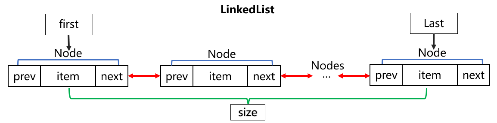

# 对 java.util.LinkedList 的理解

- **问题：对 LinkedList 的理解？**

LinkedList 我将其翻译为“链表”，其实也并不准确，LinkedList 实现了 List 接口和 Deque（双端队列） 接口，所以既可以作为链表（常用的方法有 add()、remove()、get()）使用，也可以作为队列（常用的方法有 offer()、poll()、peek()）使用（FIFO）。并且 LinkedList 内部是双向链表结构，从链表的任一端都可以遍历，所以 LinkedList 还可以作为堆栈（常用的方法有 push()、pop()）使用。得益于双链表的结构，一个 LinkedList 有多种数据结构用途，并且对于队列和堆栈的操作也添加了额外的方法（实际上方法内部调用的还是链表的基本方法）。

- **问题：LinkedList 的 Node 怎么理解？**

Node 是 LinkedList 的私有静态内部类，作为链表结构的基本元素，可以看作是链条上的一个节（结）点。一个 node 对象中除了存储元素的值外，还存储着前一个 node 和后一个 node 的引用。

- **问题：LinkedList 内部是怎么存放数据的？**

LinkedList 对数据进行封装，在内部组装成 Node。LinkedList 由下面几个部分组成，主体为若干个 Node，首尾各一个 Node 的引用，一个记录 Node 个数的 size。前后的 Node 之间互相引用，构成双向链表。如果链表为空，first 和 last 都指向 null，如果链表中只有一个 Node，first 和 last 都指向这个 Node（first 和 last 都是这个 Node 的引用）。如果链表有多个 Node，first 和 last 分别指向链表首尾的 Node。对于每个 Node 来说，如果该 Node 前还有 Node，那么这个 Node 的 prev 指向前一个 Node，否则 prev 指向 null；如果该 Node 后还有 Node，那么这个 Node 的 next 指向后一个 Node，否则 next 指向 null。

- **问题：LinkedList 是怎么进行查找的？**

LinkedList 相比于 ArrayList 的优势在于插入和删除，劣势是查找，LinkedList 类使用双向链表一定程度上确实可以提高查找效率。
LinedList 中的查询分为两种，一种是根据 index 查询 node（包含元素值），也即是 node() 方法，另一种是根据 object（元素值） 查询 index，也即是 indexOf() 方法。链表不像数组那样，可以根据 index 直接查询出元素的值，因为两者在内存种的结构是不一样的，数组存储在连续的内存空间，而链表存储不需要连续的内存空间。
链表中的 index 只是标记元素的相对于链表头部（first 指向的）node 的个数，这样在根据 index 查询时，可以根据 index 和 size 的关系，提高查询性能。当 index 大致在链表的前半部分时（index < (size >> 1)），从链表的首部开始遍历显然更快，而当 index 大致在链表的后半部分时（index > (size >> 1)），从链表的尾部开始遍历显然更快，这样就使得查找次数从 n 次将为了 n/2 次，虽然查找算法的时间复杂度还是 O(n)。
根据元素值来查找 node 的 index，使用的是 indexOf() 方法和 lastIndexOf() 方法，前一个方法是从前往后查找，后一个方法是从后往前查找。

- **问题：LinkedList 内部一些方法的区别？**

LinkedList 内部有很多功能相同的方法，方法内部大多都是调用 link 相关的方法。

| LinkedList | 添加元素      | 删除元素           | 查看元素 |
| :--------: | :-----------: | :----------------: | :------: |
| 作为链表   | add()、set() | unlink()、remove() | get()    |
| 作为队列   | offer()       | poll()             | peek()   |
| 作为栈     | push()        | pop()              | 无 |

- **问题：LinkedList 和 ArrayList 的区别**

LinkedList 是基于双向链表实现的，ArrayList 是基于数组实现的。
LinkedList 添加、插入、删除元素速度更快，而 ArrayList 查询速度更快。
LinkedList 使用 Node 来存储数据，每个 Node 中不仅存储元素的值，还存储了前一个 Node 的引用和后一个 Node 的引用，占用内存更多，而 ArrayList 使用 Object 数组来存储数据，占用内存相比会更少。
LinkedList 和 ArrayList 都是线程不安全的，可以使用 Collections 中的方法在外部封装一下。