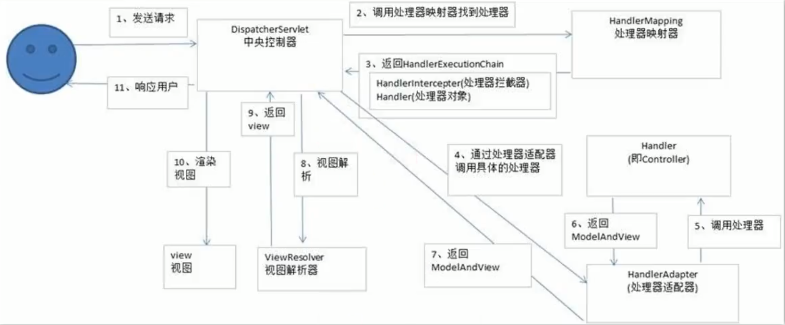

**面试题：**

简单的谈一下 SpringMVC 的工作流程？

**流程图：**

**语言描述：**

用户发送的请求，先经过前端控制器 DispatcherServlet，调用处理器映射器找到对应的处理器，处理器映射器返回 HandlerExecutionChain（包含所有的 HandlerIntercepter 处理器拦截器 和 Handler 对象），通过处理器适配器调用处理器中具体的方法处理（也即是 Controller 中的方法），返回 ModelAndView 给前端控制器，前端控制器调用视图解析器解析，返回 View，前端控制器调用 render() 方法渲染视图返回个客户端。

更详细的说明可以参考我的博客[《SpringMVC工作流程》](https://wenshixin.gitee.io/blog/2018/10/09/SpringMVC%E5%B7%A5%E4%BD%9C%E6%B5%81%E7%A8%8B/)。