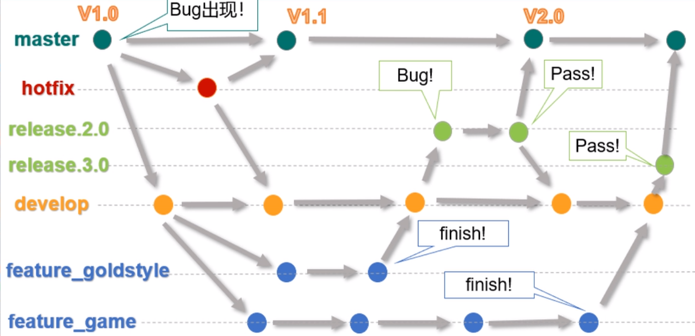

**面试题：**

Git 常用命令？

**分支命令：**

- **创建分支**
  - git branch 分支名
  - git branch -v 查看分支
- **切换分支**
  - git checkout 分支名
  - **git checkout -b 分支名（一步完成创建和切换分支）**
- **合并分支**
  - 先切换到主分支 git checkout master
  - git merge 分支名
- **删除分支**
  - 先切换到主分支 git checkout master
  - git branch -D 分支名

**Git 工作流：**

