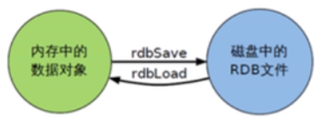
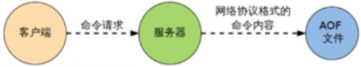

**面试题：**

Redis 持久化有哪几种方式，以及它们的区别？

**Redis 提供了 2 种不同形式的持久化方式:**

**RDB（Redis DataBase）**

RDB 是在指定的时间间隔内将内存中的数据集快照写入磁盘，也即是 SnapShot 快照，恢复时是将快照文件直接读到内存中。

**优点：**

- 节省磁盘空间
- 恢复速度快

**缺点：**

- 虽然Redis在fork时使用了写时拷贝技术，但是如果数据量庞大，还是比较消耗性能的。-

- 备份周期，在一定时间间隔内做一次备份，所以如果 Redis 意外 down 掉，就会丢失最后一次快照后的所有修改。

**AOF（Append Of File）**

以日志的形式来记录每个写操作，将 Redis 执行过的所有写指令记录下来（读指令不记录），只许追加文件但不可以改写文件，Redis 启动之初会读取该文件重新构建数据，或者说，Redis 在重启时会根据日志文件的内容将写指令从前到后执行一次来完成数据的恢复工作。

**优点：**

- 备份机制更稳健，丢失数据概率更低
- 可读的日志文本，通过操作 AOF 更安全，可以处理误操作

**缺点：**

- 比起 RDB 占用更多的磁盘空间
- 恢复备份速度慢
- 每次读写都同步的话，有一定的性能压力
- 存在个别 Bug，造成不能恢复

**备份是如何执行的？**

Redis 会单独创建（fork）一个子进程来进行持久化，会先将数据写入到一个临时文件中，待持久化过程都结束了，再用这个临时文件替换上次持久化好的文件。整个过程中，主进程是不进行任何 IO 操作的，这就确保了极高的性能，如果需要进行大规模数据的恢复，且对于数据恢复的完整性不是非常敏感，那 RDB 方式要比 AOF 方式更加的高效，但 RDB 的缺点是最后一次持久化后的数据可能丢失。

