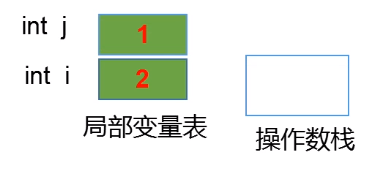
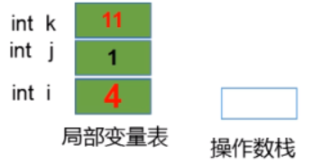

**面试题：阅读下面的代码，写出输出结果。**

``` java
public class IncrementTest {
    public static void main(String[] args) {
        int i = 1;
        i = i++;
        int j = i++;
        int k = i + ++i * i++;
        System.out.println("i = " + i);
        System.out.println("j = " + j);
        System.out.println("k = " + k);
    }
}
```

**答案：**

``` shell
i = 4
j = 1
k = 11
```

**代码分析：**

关键代码 **i = i++**，自增操作是在局部变量中的，而不是在操作数栈中。


① 把局部变量表中的 i 的值 1 压入操作数栈中

② 把局部变量表中的 i 变量自增 1，此时 i 的值为 2

③ 把操作数栈中的值 1 赋值给局部变量表中的 i 变量，此时 i 的值又变为了 1

---

重要代码 **int j = i++**，赋值操作发生在自增前。



① 把局部变量表中的 i 的值 1 压入操作数栈中

② 把操作数栈中的值 1 赋值给局部变量表中的 j 变量，此时 j 的值为 1

③ 把局部变量表中的 i 变量自增 1，此时 i 的值为 2

---

关键代码 **int k = i + ++i * i++**。



① 把局部变量表中的 i 的值 2 压入操作数栈中

② 把局部变量表中的 i 变量自增 1，此时 i 的值为 3

③ 把局部变量表中的 i 的值 3 压入操作数栈中（++i），此时 i 的值为 3

④ 再把局部变量表中的 i 的值 3 压入操作数栈中（i++），此时 i 的值为 3

⑤ 把局部变量表中的 i 变量自增 1，此时 i 的值为 4

⑥ 把操作数栈中前两个弹出求乘积（3 * 3 = 9），将结果再次压入操作数栈中

⑦ 把操作数栈中前两个弹出求和（9 + 2 = 11），将结果再次压入操作数栈中

⑧ 将操作数栈中的值 11 赋值给局部变量表中的 k 变量，此时 k 的值为 11

**总结：**

- 赋值 =，最后计算
- = 右边的从左到右加载值依次压入操作数栈
- 根据运算符的优先级判断先算哪个
- 自增和自减操作都是直接修改变量的值，不经过操作数栈
- 最后赋值之前，临时结果都是保存在操作数栈中的