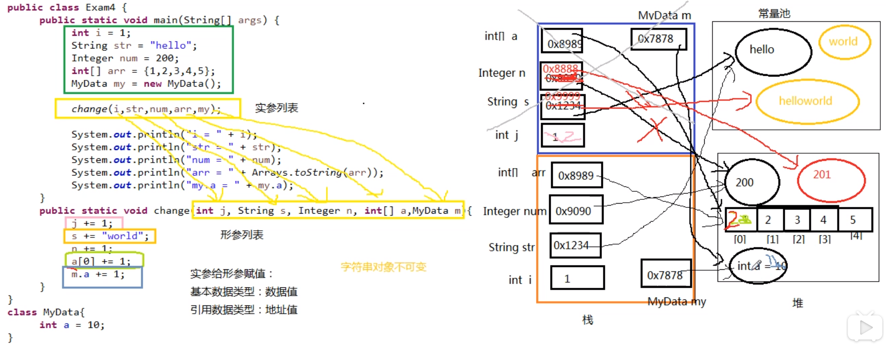

**面试题：阅读下面的代码，写出输出结果。**

```java
class MyData {
    int a = 10;
}
public class MethodArgumentTest {
    public static void main(String[] args) {
        int i = 1;
        String str = "hello";
        Integer num = 200;
        int[] arr = {1, 2, 3, 4, 5};
        MyData my = new MyData();

        change(i, str, num, arr, my);

		System.out.println("i = " + i);
        System.out.println("str = " + str);
        System.out.println("num = " + num);
        System.out.println("arr = " + Arrays.toString(arr));
        System.out.println("my.a = " + my.a);
    }

    public static void change(int j, String s, Integer n, int[] a, MyData m) {
        j += 1;
        s += "world";
        n += 1;
        a[0] += 1;
        m.a += 1;
    }
}
```

**答案：**

``` shell
i = 1
str = hello
num = 200
arr = [2, 2, 3, 4, 5]
my.a = 11
```

**考察的知识点：**

方法的参数传递机制

**方法的参数传递机制：**

（1）形参是基本数据类型

- 传递数据值

（2）实参是引用数据类型

- 传递地址值
- 特殊的类型：String、包装类型等对象不可变性

**过程分析：**

通过画内存图，来分析方法执行后的结果。

