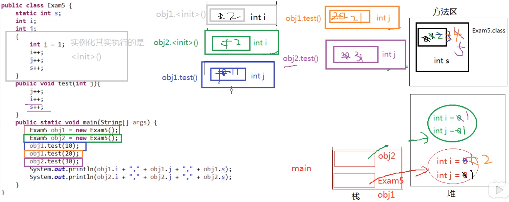

**面试题：阅读下面的代码，写出输出结果。**

``` java
public class VariableTest {
    static int s;
    int i;
    int j;

    {
        int i = 1;
        i++;
        j++;
        s++;
    }

    public void test(int j) {
        j++;
        i++;
        s++;
    }

    public static void main(String[] args) {
        VariableTest obj1 = new VariableTest();
        VariableTest obj2 = new VariableTest();
        obj1.test(10);
        obj1.test(20);
        obj2.test(30);
        System.out.println(obj1.i + "," + obj1.j + "," + obj1.s);
        System.out.println(obj2.i + "," + obj2.j + "," + obj2.s);
    }
}
```

**答案：**

``` she
2,1,5
1,1,5
```

**考察的知识点：**

- 就近原则
- 变量的分类
  - 成员变量：类变量、实例变量
  - 局部变量
- 非静态代码块的执行：每次创建实例对象都会执行
- 方法的调用规制：调用一次执行一次

**局部变量与成员变量的区别：**

（1）声明的位置

- 局部变量：方法体的{}中，形参，代码块的{}中
- 成员变量：类中方法外
  - 类变量：有static修饰
  - 实例变量：没有static修饰

（2）修饰符

- 局部变量：final
- 成员变量：public、protected、private、final、static、volatile、transient

（3）值存储位置

- 局部变量：栈
- 实例变量：堆
- 类变量：方法区

（4）作用域

- 局部变量：从声明处开始，到所属的}结束
- 实例变量：在当前类中”this.“（有时this.可以缺省），在其他类中使用”对象名.“访问
- 类变量：在当前类中”类名.“(有时类名.可以省略)，在其他类中使用"类名."或”对象名.“访问

（5）生命周期

- 局部变量：每个线程，每次调用执行都是新的生命周期
- 实例变量：随着对象的创建而初始化，随着对象的被回收而消亡，每个对象的实例变量是独立的
- 类变量：随着类的初始化而初始化，随着类的卸载而消亡，该类的所有对象的类变量是共享的

**代码分析：**

``` java
public class VariableTest {
    static int s; // 成员变量，类变量
    int i; // 成员变量，实例变量
    int j; // 成员变量，实例变量

    {
        int i = 1; // 非静态代码块中的局部变量 i
        i++; // 就近原则，是对非静态代码块中的局部变量 i 进行自增的
        j++;
        s++;
    }

    public void test(int j) { // 形参，局部变量，j
        j++; // 形参 j 自增
        i++;
        s++;
    }

    public static void main(String[] args) { // 形参，局部变量，args
        VariableTest obj1 = new VariableTest(); // 局部变量，obj1
        VariableTest obj2 = new VariableTest(); // 局部变量，obj1
        obj1.test(10);
        obj1.test(20);
        obj2.test(30);
        System.out.println(obj1.i + "," + obj1.j + "," + obj1.s);
        System.out.println(obj2.i + "," + obj2.j + "," + obj2.s);
    }
}
```

**过程分析：**

通过画内存图，来分析方法执行后的结果。



**当成员变量和xx变量重名时，如何区分：**

（1）局部变量与实例变量重名

- 在实例变量前面加“this.”

（2）局部变量与类变量重名

- 在类变量前面加“类名.”