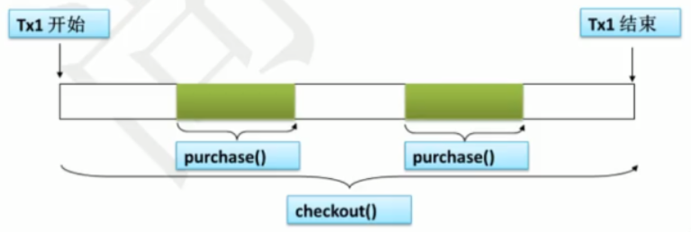
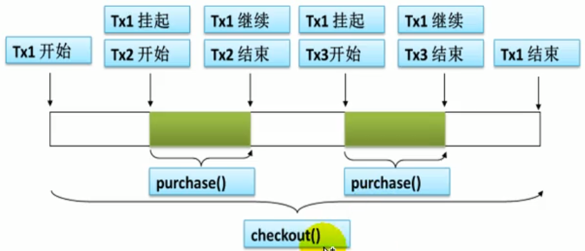

**面试题：**

请介绍下 Spring 支持的常用数据库事务传播属性和事务隔离级别？

**参考答案：**

---

**事务传播属性：**

当事务方法被另一个事务方法调用时，必须指定事务应该如何传播。（一个方法运行在了一个开启事务的方法中时，当前方法是使用原来的事务还是开启一个新的事务）例如：方法可能继续在现有事务中运行，也可能开启一个新事务，并在自己的事务中运行。事务的传播行为可以由传播属性指定，Spring 定义了 7 种传播行为。

|   传播属性    |                             描述                             |
| :-----------: | :----------------------------------------------------------: |
|   REQUIRED    | 默认值，如果有事务正在运行，当前的方法就在这个事务内运行，否则就开启一个新的事务，并在自己的事务内运行。 |
| REQUIRED_NEW  | 当前的方法必须启动新事务，并在它自己的事务内运行，如果有事务正在运行，应该将原来的事务挂起。 |
|   SUPPORTS    | 如果有事务正在运行，当前的方法就在这个事务内运行，否则它可以不运行在事务中。 |
| NOT_SUPPORTED | 当前的方法不应该运行在事务中，如果有运行的事务，将这个事务挂起。 |
|   MANDATORY   | 当前的方法必须运行在事务内部，如果没有正在运行的事务，就抛出异常。 |
|     NEVER     | 当前的方法不应该运行在事务中，如果有运行的事务，就抛出异常。 |
|    NESTED     | 如果有事务在运行，当前的方法就应该在这个事务的嵌套事务内运行，否则，就启动一个新的事务，并在它自己的事务内运行。 |

事务传播属性可以在 @Transactional 注解的 propagation 属性中定义。

---

举个例子，小明有 100 元，有两本书，一本 50 元，一本 60 元。

把购买任意一本书的行为看成一个方法 purchase()，把购买后的结账行为看成另一个方法 checkout()。这两个方法都有添加了 @Transactional 注解。

在 checkout() 方法中根据购买的书籍来调用对应的 purchase() 方法。

REQUIRED 传播行为：

**此时小明一本书也买不成功。**

REQUIRED_NEW 传播行为：

**此时小明可以买成功 1 本书。**

---

**事务隔离级别：**

数据库事务并发问题：

假设现在有两个事务，Transaction1 和 Transaction2 并发执行。

1）**脏读**：读到的是未提交的值（更新值）

① Transaction1 将某条记录的值从 20 修改为了 30。

② Transaction2 读取了 Transaction1 更新后的值。

③ Transaction1 回滚，值恢复到了 20。

④ Transaction2 读取到的 30 就是一个无效值。

2）**不可重复读**：两次读取的结果不一致

① Transaction1 读取值为 20。

② Transaction2 将值修改为 30。

③ Transaction1 再次读取为 30，和第一次读取的结果不一致。

3）**幻读**：

① Transaction1 读取表中的一部分数据。

② Transaction2 向表中插入了新的行。

③ Transaction1 读取表中数据时，多出了一些行。

数据库系统必须具有隔离并发运行各个事务的能力，使他们不会相互影响，避免各种并发问题。**一个事务与其他事务隔离的程度称为隔离级别。**SQL标准中规定了多种事务隔离级别，不同隔离级别对应不同的干扰程度，隔离级别越高，数据一致性就越好，但并发性越弱。

1）读未提交：READ UNCOMMITED

允许 Transaction1 读取 Transaction2 未提交的修改。

2）读已提交：READ COMMITED

要求 Transaction1 只能读取 Transaction2 已提交的修改。

3）可重复读：REPEATABLE READ

确保 Transaction1 可以多次从一个字段中读取到相同的值，即 Transaction1 执行期间禁止其它事务对这个字段进行更新。

4）串行化：SERIALIZABLE

确保 Transaction1 可以多次从一个表中读取到相同的行，在 Transaction1 执行期间，禁止其它事务对这个表进行添加、更新、删除操作。可以避免任何并发问题，但性能十分低下。

**各个隔离级别解决并发问题的能力见下表：**

|      级别       | 脏读 | 不可重复读 | 幻读 |
| :-------------: | :--: | :--------: | :--: |
| READ UNCOMMITED |  有  |     有     |  有  |
|  READ COMMITED  |  无  |     有     |  有  |
| REPEATABLE READ |  无  |     无     |  有  |
|  SERIALIZABLE   |  无  |     无     |  无  |

**各种数据库产品对事务隔离级别的支持程度：**

|      级别       |  Oracle   |   MySQL   |
| :-------------: | :-------: | :-------: |
| READ UNCOMMITED |     ×     |     √     |
|  READ COMMITED  | √（默认） |     √     |
| REPEATABLE READ |     ×     | √（默认） |
|  SERIALIZABLE   |     √     |     √     |