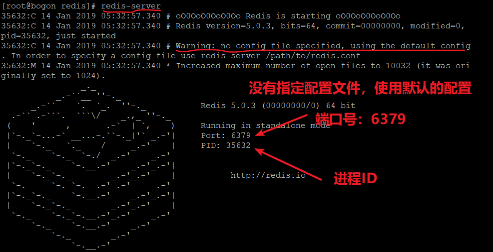

# Linux 下安装 Redis

## 1、下载 Redis

去Redis[官网](https://redis.io/)上下载 Redis 的源码包，并在Linux系统中解压。

## 2、安装 Redis

进入 Redis 的解压文件，使用 `make` 命令编译源码

可能出现的错误：`fatal error: jemalloc/jemalloc.h: No such file or directory`

在 Redis 的 README.md 文件中，可以找到解决方法，手动设置 MALLOC 环境。

使用 `make MALLOC=libc` 命令代替 `make` 命令。

---

编译好 Redis 之后，可以使用 `make test` 命令测试一下。

可能出现提示 `You need tcl 8.5 or newer in order to run the Redis test` ，这是缺少 tcl 包，安装一下 tcl 就好了（如 `yum install tcl`）。

---

测试完成，就可以安装 Redis 了，先 cd 到 Redis 解压文件的 src 目录，使用 `make PREFIX=/usr/local/redis install` 安装，可以设置 Redis 的安装位置。

## 3、配置 Redis

安装完 Redis，可以看到 Redis 安装目录下只有一个 bin 目录，目录内容如下：

- redis-server —— Redis 的服务器
- redis-cli —— Redis 的命令行客户端
- redis-benchmark —— Redis 的性能测试工具
- redis-check-rdb —— Redis 的 RDB 文件检索工具
- redis-check-aof —— Redis 的 AOF 文件修复工具
- redis-sentinel —— Redis 的集群监控工具

**前台启动**

使用 `redis-server` 命令就可以启动 Redis 服务器了，但是默认是前台启动方式，也就是 Redis 会占用当前的终端窗口。

**后台启动**

后台启动方式，需要指定配置文件，拷贝 redis 解压文件中的 redis.conf 文件到 Redis 的安装目录（方便查找），修改拷贝后的 redis.conf 文件中的内容，将 `daemonize no` 改为 `daemonize yes`，也即是将 Redis 服务器作以守护进程方式运行。

在启动时，使用 `redis-server /path/redis.conf` 命令启动，path 为你指定的配置文件目录，这样 Redis 就不会占用终端窗口了。

使用查看进程命令，看 Redis 是否真正启动成功，`ps -aux | grep redis`。

使用 `redis-cli` 命令启动 Redis 的命令行窗口，`ping` 命令来测试是否可以连接 Redis 服务器。

**核心配置**

- `bind 127.0.0.1`

绑定的IP地址，默认只允许本机访问 Redis，也即是 127.0.0.1（localhost），如果其他IP也想访问，可以将 `bind 127.0.0.1` 改为 `bind 指定的IP地址`，IP 地址设置成 0.0.0.0 表示允许任何IP访问，但这样做不安全！！！

- `port 6379`

端口号，默认端口 6379，可以修改为其他端口。

- `daemonize no`

是否以守护进程方式运行，默认是前台启动方式，可以修改为后台启动方式。

- `dbfilename dump.rdb`

数据文件，默认数名称为 dump.rdb。

- `dir ./`

数据文件存储的位置，默认是与执行命令的位置处于同一目录。

- `logfile ""`

日志记录的位置，默认是直接输出到控制台中。

- `database 16`

数据库个数，默认是 16 个。