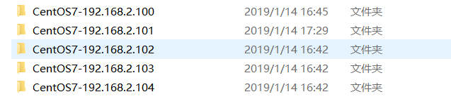
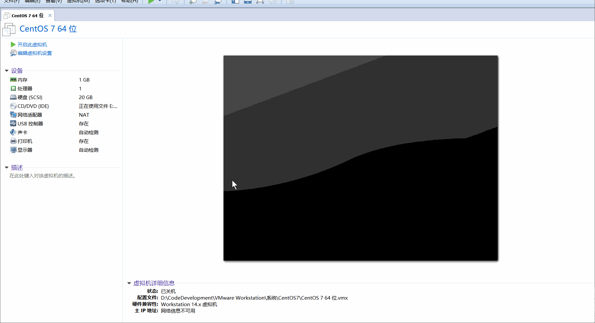
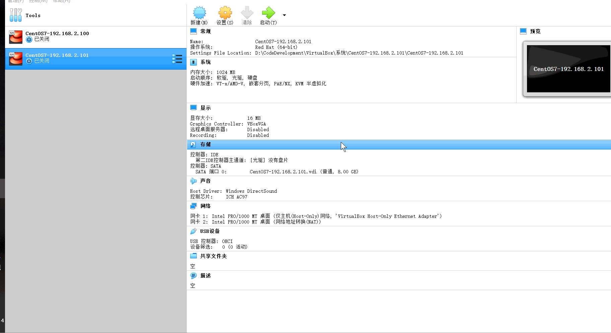

# VMWare 和 VirtualBox 中的 CentOS 配置静态 IP地址总结

手里没有那么多云服务器（还是家里没矿呀~），所以想用虚拟机虚拟出几台机器搭建一些软件的集群环境，但虚拟机中的系统 IP地址默认是动态分配的，这就给连接带来了很大的麻烦，启动虚拟机运行系统，然后在主机中使用终端工具更加方便的连接这些机器（假装自己有很多的服务器~）。给机器配置静态 IP，使用 IP地址给每台机器编号，也有利于使用终端连接和使用。

## 1、VMWare 中的配置

**关键地方：**

1、虚拟机设置中使用NAT模式。

2、虚拟机编辑器中的子网IP，DHCP 设置中的 IP 地址范围（后面在系统中设置IP地址时要在这个范围内），NAT 设置中的网关（后面也要用到，要记住）。

3、在系统的网络连接中，找到 VMnet8 网卡，属性中查看 IPv4 的配置，是否和虚拟机编辑器中配置的相同，IP 地址、子网掩码：255.255.255.0、默认网关和虚拟机编辑器设置的网关保持一致。

## 2、VirtualBox 中的配置

**关键地方：**

1、虚拟机系统设置中，网络中的网卡1设置为仅主机（Host-Only）网络（连通外部物理主机的网络），网卡2设置为网络地址转换（配置静态IP）。

2、管理菜单中的主机网络管理器，IPv4地址（后面要用），DHCP 服务器，设置服务器地址（和前面的IPv4保持一致即可），地址范围。

3、在系统的网络连接中，找到 VirtualBox Host-Only Network 网卡，属性中查看 IPv4 的配置，是否和虚拟机编辑器中配置的相同，IP 地址、子网掩码：255.255.255.0、默认网关和虚拟机编辑器设置的网关保持一致。

## 3、CentOS 中的配置

使用 `ip addr` 命令可查看当前网络 IP 地址。

使用命令 `cd /etc/sysconfig/network-scripts` 进入网卡配置文件夹，`ls` 查看文件，ifcfg-enth0 等文件就是网卡配置文件，vi 命令打开编辑文件。

注意红线框住的那几行，**IPADDR** 为你手动为系统分配的静态IP地址，**NETMASK** 为子网掩码，**GATEWAY** 为网关（和你前面配置的一样），**DNS1** 要和网卡配置一样。

使用 `service network restart` 重启网卡让配置生效。

再次使用 `ip addr` 命令可查看当前网络 IP 地址看是否和配置的一样。

使用 ping 命令看是否可以连接外网（没有该命令的话使用 `yum install -y net-tools` 安装）。

